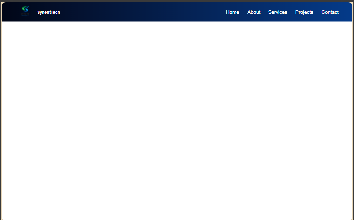
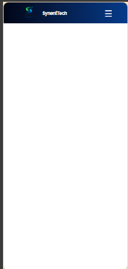
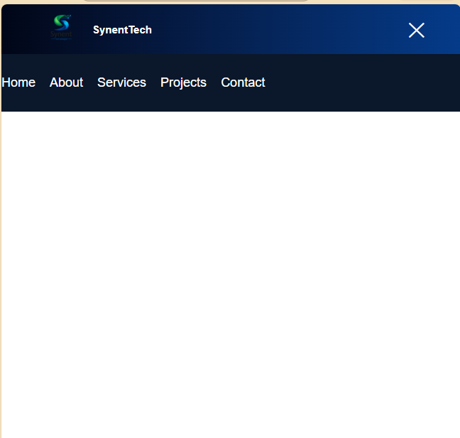

# Responsive Navigation Bar

A modern and fully responsive navigation bar built using **HTML, CSS, and JavaScript**.

This project is developed as **Synent Technologies Internship Task 4 - Responsive Navigation Bar**.

The navigation bar provides a smooth user experience across desktop and mobile devices with a hamburger menu functionality.

---

# 🚀 Features

- Responsive navigation bar design
- Company logo integration
- Navigation links section
- Hamburger menu for mobile screens
- JavaScript menu toggle functionality
- Smooth transition effects
- Mobile-friendly layout
- Clean and modern UI design

---

# 🛠️ Technologies Used

- HTML5
- CSS3
- JavaScript (ES6)

---

# 📱 Responsive Design

The navigation bar automatically adjusts according to screen size:

### Desktop View
- Displays complete navigation links
- Shows logo and menu items horizontally

### Mobile View
- Navigation links are hidden
- Hamburger icon appears
- Menu opens and closes using JavaScript toggle

---

# 📸 Project Preview

## Desktop View




## Mobile View




## Hamburger Menu



---

# ⚙️ How to Run the Project

Follow these steps to run the project locally:

1. Clone this repository:

```bash
git clone https://github.com/Niaz-ops/Synent-Task4-ResponsiveNavbar-sadiaSamreen.git
```

2. Open the project folder.

3. Open `index.html` in your browser.

4. Resize the browser window or use mobile view to test responsiveness.

---

# 📂 Project Structure

```
Synent-Task4-ResponsiveNavbar-sadiaSamreen
│
├── index.html
├── style.css
├── script.js
├── README.md
│
└── images
    ├── desktop.png
    ├── mobile.png
    └── menu.png
```

---

# 🎯 Learning Outcomes

Through this project, I learned:

- Creating responsive layouts using CSS media queries
- Designing navigation bars for different screen sizes
- Implementing hamburger menus using JavaScript
- Handling DOM elements with JavaScript
- Improving UI/UX design
- Organizing frontend project files professionally

---

# 👩‍💻 Developer

**Sadia Samreen**

Computer Systems Engineering Student

Frontend Web Developer


---

# 📌 Internship Details

Developed for:

**Synent Technologies Internship Program**

Task:

**Task 4 - Responsive Navigation Bar**

---

⭐ If you like this project, feel free to explore and improve it.